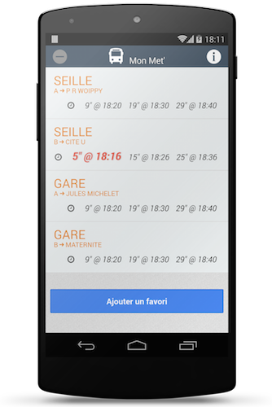

MonMet
======

## MonMet

MonMet is a free mobile application that let user saves the time tables of his favorite bus stops
and have a quick look on them whenever he wants.

The application is composed of:

* A mobile application using ionic framework
* A backend using spring boot and redis.

## Screenshots

 

## Dependencies

* Java 8
* Maven 3+
* Redis
* ionic framework
* Tesseract (`brew install tesseract`) + Tesseract4j
* GhostScript (`brew install ghostscript`)

## Running the Backend

Run redis
```
redis-server
```

Init redis
```
cat src/main/resources/init.redis | redis-cli -x
```

Run the backend
```
mvn package
nohup java -jar target/MonMet*.jar &
```

Run the app on your computer
```
cd MonMet && ionic serve
```

Run the app on your device
```
cd MonMet && ionic run android
or
cd MonMet && ionic run ios
```

## REST API

| Method  | Path                                                 | Description                                                |
|:-------:| ---------------------------------------------------- | -----------------------------------------------------------|
|   GET   | /api/lines                                           | Get the available lines bus lines.                         |
|   GET   | /api/lines/{lineId}                                  | Get the available heads (directions) for a specific line   |
|   GET   | /api/lines/{lineId}/{head}                           | Get the available stops for a specific line and head       |
|   GET   | /api/tt/{lineId}/{head}/{stopId}?stopName={stopName} | Get the timetable for a specific line, head and stop       |
|   GET   | /api/coords/{lineId}/{stopName}                      | Get the coordinates for a specific stop of a bus line.     |


## Sample JSON

#### GET `/api/lines`

```json
{
    "Mettis": [
        {
            "id": "998",
            "name": "A",
        },
        {
            "id": "999",
            "name": "B",
        }
    ],
    ...
}
```

#### GET `/api/lines/{lineId}`

```json
[
    "CITE U",
    "MATERNITE",
    ...
]
```


#### GET `/api/lines/{lineId}/{head}`

```json
[
    {
        "id": "21327",
        "name": "REPUBLIQUE",
    },
    {
        "id": "31329",
        "name": "CITE U",
    },
    ...
]
```


#### GET `/api/tt/{lineId}/{head}/{stopId}?stopName={stopName}(&timestamp={timestamp})`

```json
{
    "week": [
        "05:18",
        "05:36",
        "06:10",
        "06:28",
        "06:43",
        ...
    ],
    "saturday": [
        "05:18",
        "05:36",
        "06:06",
        "06:36",
        ...
    ],
    "sunday": [
        "05:18",
        "06:36",
        "07:12",
        "08:05",
        "08:35",
        ...
    ],
    "nextRides": [
        "19:06",
        "19:16",
        "19:26"
     ]
}
```

#### GET `/api/coords/{lineId}/{stopName}`

```json
{
    "lat": 49.121565,
    "lon": 6.175176
}
```
